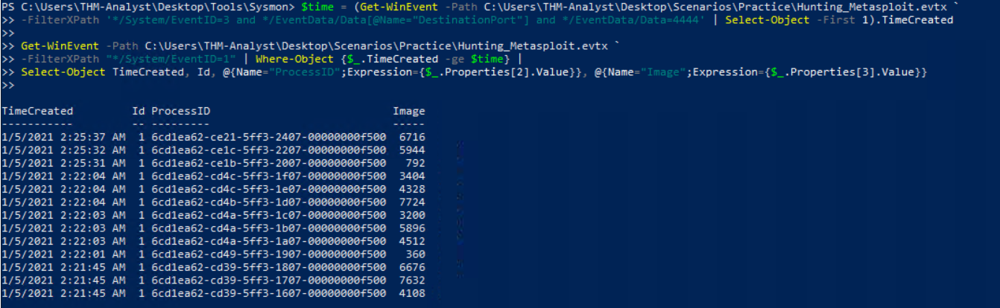
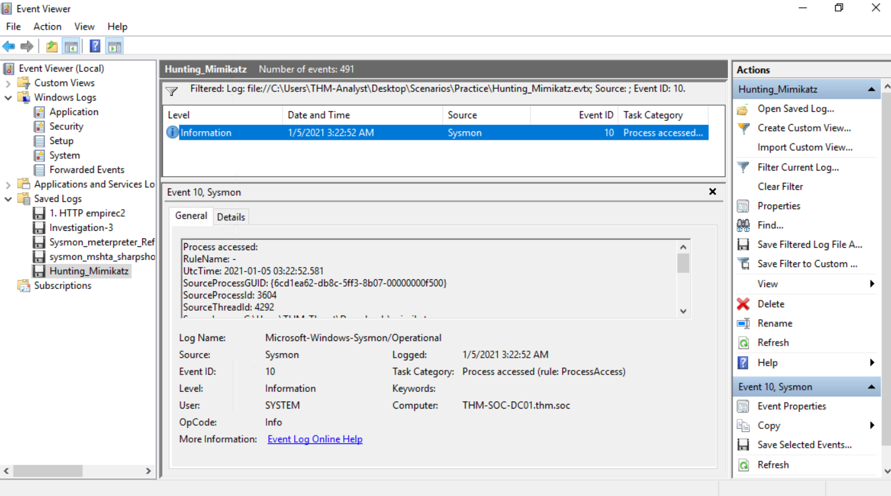
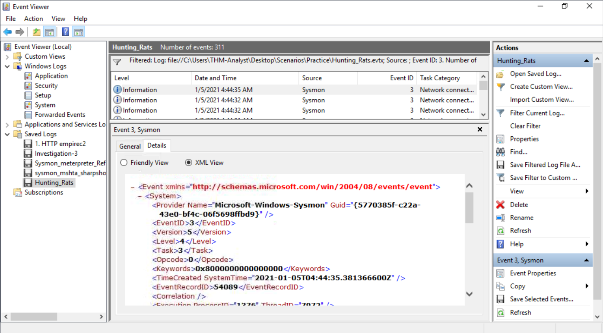
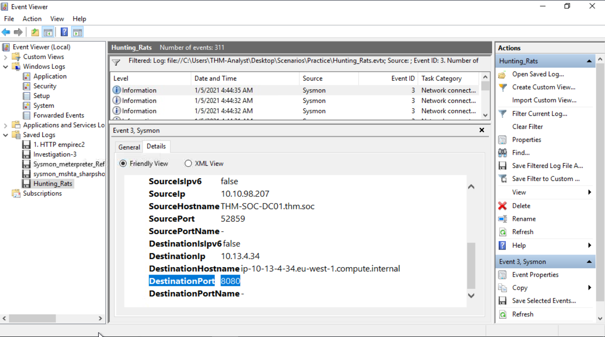
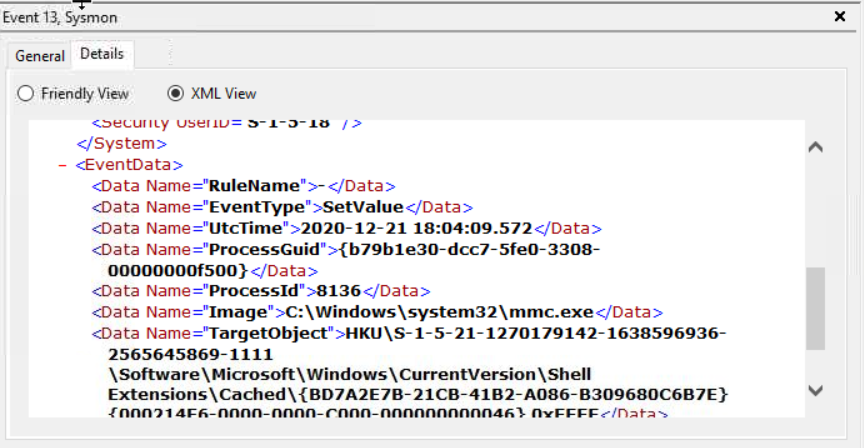

# Sysmon: Windows Endpoint Monitoring

##  Category  
Endpoint Security → Windows Event Logging  

##  Objective  
Gain experience with Sysmon to detect malicious activity on Windows hosts.

##  Event IDs Covered  
- **3**: Network Connections (Metasploit)  
- **10**: Process Access (Mimikatz LSASS access)  
- **11/13**: File Creation (Persistence – Startup folder)  

---

##  Process (Steps Taken)  
1. Installed Sysmon and reviewed the configuration file.  
2. Generated sample events (process launches, network connections).  
3. Investigated logs in Event Viewer for anomalies.  
4. Correlated suspicious processes with malicious behavior, focusing on:  
   - Unusual network connections (ports 4444/5555)  
   - LSASS access by Mimikatz  
   - File creation in Startup folder for persistence  

---

##  Key Findings  
- Detected **Metasploit network connection** on suspicious port (4444/5555).  
- Identified **Mimikatz accessing LSASS** (`C:\Windows\system32\lsass.exe`).  
- Observed **persistence technique** by adding a file to the Startup folder.  
- Learned how Sysmon captures detailed process and network activity to aid SOC investigations.

---

##  Event Correlation  
By reviewing these events together, you can see the sequence of an attack:  
1. **Initial Access / Network Connection** (Metasploit)  
2. **Credential Access** (Mimikatz targeting LSASS)  
3. **Persistence** (file added to Startup folder)  

This demonstrates how Sysmon data can help trace malicious activity across multiple stages of a compromise.  

---

##  Outcome / What I Learned  
- Gained practical experience monitoring Windows endpoints with Sysmon.  
- Learned how to identify malicious network connections, credential access, and persistence techniques.  
- Improved ability to **correlate multiple events** for threat hunting and incident response.

---

##  Screenshots  

