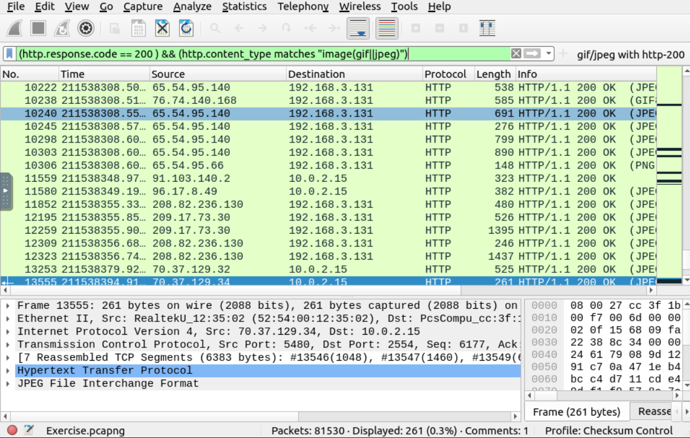
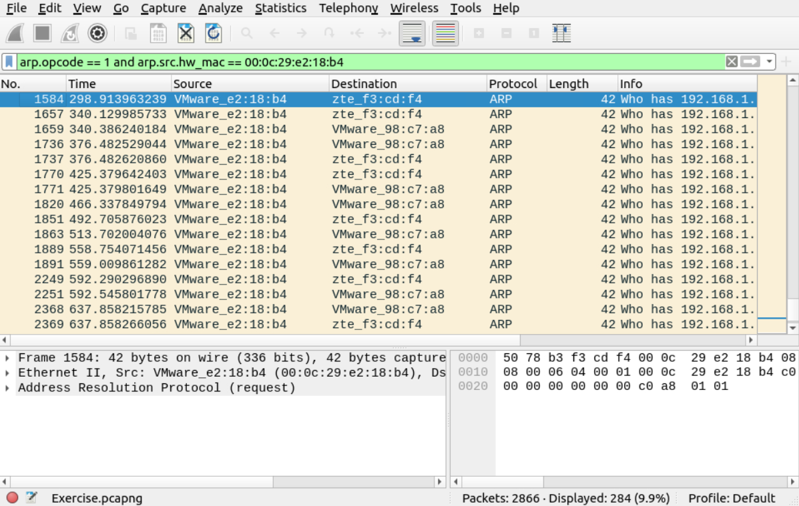

# Wireshark: Traffic Analysis

## Category  
📂 Network Security → Packet Analysis  

## Objective  
Learn how to capture, filter, and analyze network traffic to identify suspicious or malicious activity.  

## Tools/Skills Practiced  
- Wireshark filters (http.request, tcp.flags.syn, etc.)  
- Packet inspection and reconstruction  
- Identifying anomalies in network flows  
- Recognizing common IoCs in PCAPs  

## Process (Steps Taken)  
1. Opened provided PCAP files in Wireshark.  
2. Applied display filters to isolate HTTP, DNS, and TCP traffic.  
3. Identified suspicious patterns (e.g., repeated failed logins, unusual beaconing).  
4. Reconstructed sessions to confirm malicious behavior.  

## Key Findings  
- Isolated brute-force login attempts within packet captures.  
- Detected beaconing activity consistent with Command & Control (C2).  
- Learned to filter network traffic to focus on attack patterns.

## Outcome / What I Learned  
- Gained hands-on practice with packet analysis fundamentals.  
- Learned how to detect anomalies that indicate attacks.  
- Understood how Wireshark fits into SOC investigations for real-time traffic analysis. 

## Screenshots

 
